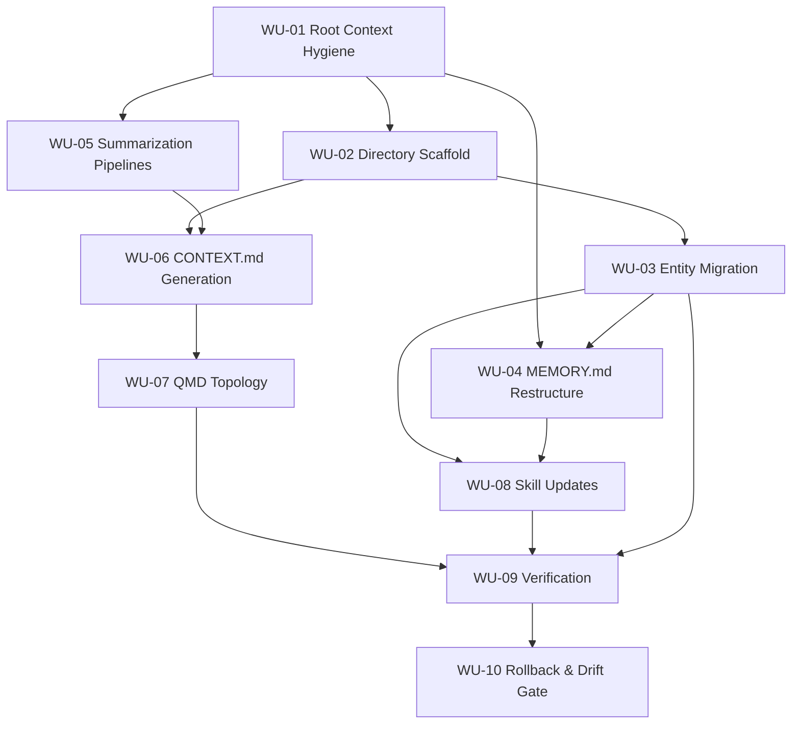

# BUILD-PLAN — PAIGE Pass 3 (Memory Architecture Redesign)

## Scope
Create an incremental, file-based migration from monolithic memory into a temporal, searchable architecture without deleting history.

## Work Units

### WU-01 — Root Context Hygiene + Migration Baseline
- **Description**: Establish the migration boundary, identify which root `.md` files are boot-critical vs movable, and define the non-negotiables for identity continuity before any other change.
- **Constraints**: C-001, C-002, C-003, C-004, C-020, C-026
- **Input / Dependencies**:
  - `projects/memory-rewrite/CONSTRAINTS.md`
  - `projects/memory-rewrite/ARCHITECTURE.md`
  - `AGENTS.md`, `SOUL.md`, `IDENTITY.md`, `USER.md`, `MEMORY.md`, `TOOLS.md`
  - Workspace root `.md` inventory (current file list)
- **Output artifacts**:
  - `projects/memory-rewrite/context-surface-inventory.md` (approved list: keep/move)
  - `projects/memory-rewrite/migration-rollup.md` (phase rollback notes + decision log)
- **Drift anchors**:
  - Before: `CONSTRAINTS.md:C-002` (line 51) + `C-003` (line 57)
  - After: same constraints, and `C-020` (line 185) for post-move boot-growth check
- **Effort**: M
- **Agent**: **MIKA directly**
- **Notes on parallelism**: Can start immediately; blocks all downstream units.

### WU-02 — Structural Scaffold for New Memory Domains
- **Description**: Create required directories and non-destructively migrate eligible legacy docs; ensure no historical daily log edits; set up staging/summary paths and archive namespace.
- **Constraints**: C-002, C-003, C-017, C-023, C-026
- **Input / Dependencies**:
  - `ARCHITECTURE.md §2`
  - `CONSTRAINTS.md:C-002`, `C-017`, `C-023`
  - Output from WU-01
- **Output artifacts**:
  - `memory/lessons/`
  - `memory/people/`
  - `memory/decisions/`
  - `memory/summaries/`
  - `memory/archive/`
  - `scripts/`
- **Drift anchors**:
  - Re-read before/after: `C-017` (line 165), `C-023` (line 223), `C-026` (line 244)
- **Effort**: S
- **Agent**: **MIKA directly**
- **Notes on parallelism**: Can run in parallel with WU-03 once path ownership is approved.

### WU-03 — Entity Migration: Lessons, People, Decisions from Legacy Notes
- **Description**: Migrate inline lessons/people/decision content into first-class files with required frontmatter; keep legacy daily logs immutable after migration.
- **Constraints**: C-010, C-013, C-016, C-018, C-019
- **Input / Dependencies**:
  - `MEMORY.md`
  - `memory/*.md` (historical logs, read-only)
  - `ARCHITECTURE.md §6`
  - Frontmatter schema examples in this doc
- **Output artifacts**:
  - `memory/lessons/<category>-<slug>.md`
  - `memory/people/<person-slug>.md`
  - `memory/decisions/YYYY-MM-DD-<slug>.md`
  - `projects/memory-rewrite/entity-migration-log.md` (source traceability and one-time decisions)
- **Drift anchors**:
  - Before: `C-013` (line 130), `C-016` (line 159), `C-018` (line 171), `C-019` (line 177)
  - After: same + `C-010` (line 110) to confirm old daily logs are not rewritten
- **Effort**: L (manual extraction/quality validation heavy)
- **Agent**: **Codex**

### WU-04 — MEMORY.md Restructure to Curated Boot Index
- **Description**: Convert MEMORY.md from a content dump to a compact identity + active-state index; keep inline details out and replace with pointers to new entity files and active summaries.
- **Constraints**: C-001, C-002, C-003, C-004, C-020
- **Input / Dependencies**:
  - `MEMORY.md` (current)
  - Outputs from WU-03
  - `AGENTS.md` / `TOOLS.md` for operational sections
- **Output artifacts**:
  - `MEMORY.md` (edited)
  - Project-level pointers in each `projects/*/README.md` kept accurate
- **Drift anchors**:
  - Before: `C-001` (line 45), `C-003` (line 57)
  - After: `C-002` (line 51), `C-020` (line 185)
- **Effort**: M
- **Agent**: **Claude Code** (best for structural editorial + consistency)

### WU-05 — Temporal Summarization Pipeline + Scheduled Jobs
- **Description**: Implement weekly/monthly/quarterly summary prompts and cron scheduling, including retry+failure logging and explicit gating by context-window threshold.
- **Constraints**: C-005, C-006, C-007, C-008, C-009, C-022
- **Input / Dependencies**:
  - `ARCHITECTURE.md §5`
  - `VERIFICATION-PLAN.md §C-006`, `§C-007`, `§C-009`
  - `memory/summaries/` from WU-02
- **Output artifacts**:
  - `scripts/summarize-weekly.md`
  - `scripts/summarize-monthly.md`
  - `scripts/generate-context.md`
  - `scripts/context-config.json`
  - Cron jobs:
    - `summarize-weekly` (Sun 03:00 CST)
    - `summarize-monthly` (1st 04:00 CST)
    - `summaries-q-synthesis` (gated via config)
- **Drift anchors**:
  - Before: `C-006` (line 86), `C-007` (line 92), `C-009` (line 104)
  - After: `C-008` (line 98), `C-022` (line 212)
- **Effort**: L
- **Agent**: **MIKA directly**

### WU-06 — CONTEXT.md Generation and Boot Injection Layer
- **Description**: Generate and validate auto-overwritten `CONTEXT.md` with yesterday/this-week summaries, open threads, and an awareness index; ensure root-injected auto-context remains fresh.
- **Constraints**: C-001, C-003, C-005, C-022, C-025
- **Input / Dependencies**:
  - `scripts/generate-context.md`, `scripts/context-config.json`
  - Daily logs + summaries + entity counts
  - OpenClaw boot behavior (root `.md` injection)
- **Output artifacts**:
  - `CONTEXT.md` (root)
  - `memory/summaries/errors.log` entries for repeated summarization failures
- **Drift anchors**:
  - Before: `C-003` (line 57), `C-005` (line 77), `C-022` (line 212)
  - After: `C-025` (line 235), `C-009` (line 104)
- **Effort**: M
- **Agent**: **Claude Code**

### WU-07 — QMD Topology, Collection Tags, and Freshness Controls
- **Description**: Ensure search reliability by tagging memory collections, maintaining index cadence, and isolating archive docs from default search while keeping retrieval paths intact.
- **Constraints**: C-011, C-013, C-014, C-015, C-023, C-024
- **Input / Dependencies**:
  - `qmd` existing install and current cron config
  - `VERIFICATION-PLAN.md` index freshness and search sections
  - Outputs of WU-02, WU-05, WU-06
- **Output artifacts**:
  - qmd collection metadata updates (context tags for `memory/lessons`, `memory/people`, `memory/decisions`, `memory/summaries`)
  - Optional `qmd` archive collection for `memory/archive/`
  - `qmd cron` schedule validated at 30 min
  - Optional immediate indexing hook after memory writes (`qmd update`)
- **Drift anchors**:
  - Before: `C-014` (line 145), `C-015` (line 151), `C-023` (line 223)
  - After: `C-011` (line 118), `C-024` (line 229)
- **Effort**: M
- **Agent**: **MIKA directly**

### WU-08 — Skill Updates + Authoring Guardrails
- **Description**: Update `memory-forge` and `optimize-memory` workflows to create/search against entity files, enforce frontmatter/lint checks, and add boot-size monitoring.
- **Constraints**: C-013, C-016, C-020, C-010, C-004
- **Input / Dependencies**:
  - `skills/memory-forge/SKILL.md`
  - `skills/optimize-memory/SKILL.md`
  - `ARCHITECTURE.md §8`
  - Outputs from WU-03 and WU-04
- **Output artifacts**:
  - `skills/memory-forge/SKILL.md` (PROMOTE + immediate index step updates)
  - `skills/optimize-memory/SKILL.md` (frontmatter + boot-size + immutability checks)
  - `scripts/metadata-audit.sh` (frontmatter coverage)
  - `memory/boot-size-log.json`
- **Drift anchors**:
  - Before: `C-013` (line 130), `C-020` (line 185)
  - After: `C-023` (line 223), `C-004` (line 69)
- **Effort**: M
- **Agent**: **Claude Code**

### WU-09 — Verification Harness, Baselines, and Regression Gates
- **Description**: Implement automated/manual checks from VERIFICATION-PLAN with one execution baseline per migration phase and a recurring test schedule.
- **Constraints**: C-001, C-002, C-003, C-006, C-007, C-009, C-011, C-012, C-013, C-014, C-015, C-020, C-021, C-025, C-026
- **Input / Dependencies**:
  - `VERIFICATION-PLAN.md`
  - Outputs from WU-04, WU-05, WU-07, WU-08
- **Output artifacts**:
  - `scripts/verify-c*` (full set from VERIFICATION-PLAN)
  - `scripts/precision-test-suite.json`
  - Baseline reports per phase: `memory/verification/phase-<n>-baseline.md`
- **Drift anchors**:
  - Before: `C-011` (line 118), `C-012` (line 124), `C-021` (line 191)
  - After: `C-026` (line 244), `C-025` (line 235)
- **Effort**: L
- **Agent**: **Codex** (bulk script authoring), **MIKA** (run/manual validation)

### WU-10 — Rollback Paths, Degradation Drills, and Delivery Gate
- **Description**: Hard-stop controls to prevent migration fragility: per-phase rollback, cron failure simulations, and explicit acceptance criteria before advancing phases.
- **Constraints**: C-024, C-025, C-026, AC-001, AC-002, AC-005
- **Input / Dependencies**:
  - `AGENTS.md`, `HEARTBEAT.md`
  - Outputs and logs from WU-09
- **Output artifacts**:
  - `projects/memory-rewrite/ROLLBACK.md` (phase-by-phase reversibility)
  - `HEARTBEAT.md` update for CONTEXT freshness/crons watch
  - `memory-rewrite/migration-readiness-check.md` (go/no-go checklist)
- **Drift anchors**:
  - Before: `C-025` (line 235), `C-026` (line 244)
  - After: same constraints once rollback + degradation checks pass
- **Effort**: M
- **Agent**: **MIKA directly**

## Dependency Graph (blocking order)

### Explicitly parallelizable paths
- WU-03 and WU-05 can run in parallel once WU-02 is complete.
- WU-04 and WU-07 can run in parallel after WU-03 and WU-06 are stable.
- WU-08 can run alongside WU-09 once WU-03 and WU-07 have initial outputs.

## Blind-Spot Watchlist

### Edge Cases / Failure Modes
- **Frontmatter quality drift**: manual logs without required metadata degrade precision despite schema compliance on new files.
- **Context inflation from root cleanup miss**: a forgotten `*.md` at root silently exceeds C-002 budget.
- **Cron silence with no alerting**: all scheduled jobs pass until humans notice stale output.
- **Summarizer quality regressions**: weekly prompts passing syntax but losing rationale/decision context.
- **Cross-session divergence**: summary output generated in one session format not matching assumptions in another.

### Race Conditions
- Simultaneous cron runs writing `CONTEXT.md` and summary artifacts over weak locks.
- Index update race between `qmd` 30-min cron and immediate `qmd update` invoked by skills.
- Concurrent edits to MEMORY.md and `scripts/` prompts while verification is running.

### Rollback Assumptions
- Per-phase rollback assumes only additive file operations except controlled edits in MEMORY and root list.
- Any rollback requiring project state restoration must keep archived artifacts read-only (no hard delete).
- If root `*.md` files are moved, symlink strategy for compatibility should be pre-approved per workflow dependency.

### Observability Gaps
- No built-in alert if `qmd query` latency regresses above 2s between runs.
- No built-in watcher for CONTEXT freshness (beyond scheduled generation); need heartbeat check.
- No synthetic corpus benchmark currently exists for 5000-doc scale.

## Self-Interrogation

1. **What am I assuming that isn't in CONSTRAINTS.md?**
   - That OpenClaw root `.md` injection behavior is deterministic and stable over time (beyond current A-003).
   - That qmd can support an additional archive collection without extra daemon changes.
   - That moving root markdown files won’t break external tooling references; this is process-dependent and must be verified.

2. **What would an adversarial reviewer challenge?**
   - “Why are you adding new scripts and cron jobs before proving current qmd performance at scale?”
   - “Why are you restructuring root files when there are no explicit constraints about *which* files are boot-critical beyond composition order?”
   - “Why not add a hard frontmatter hook instead of relying on convention + lint scripts?”

3. **What failure mode am I not accounting for?**
   - A partial migration where root file reorganization succeeds but OpenClaw injection cache preserves stale context until restart, creating false positives in C-001/C-003 checks.

4. **Which constraint am I closest to violating?**
   - **C-002** and **C-012** are the most fragile:
     - C-002 because root file bloat is already active (~28K tokens), immediate cleanup required before next phase.
     - C-012 because precision-at-3 is implementation quality and needs synthetic benchmark proof.

5. **What would Jerome say “that’s not what I meant”?**
   - “Don’t over-optimize for architecture cleanliness if it slows actual recall in the first 2 weeks.”
   - “Keep this implementable: no silent complexity, no hidden file movement dependency failures.”
   - “If it can’t prove faster retrieval and continuity, pause and simplify.”

## Constraint Coverage (every C-001..C-026 hit at least once)

- **C-001**: WU-04, WU-06, WU-09
- **C-002**: WU-01, WU-04, WU-09
- **C-003**: WU-01, WU-04, WU-06
- **C-004**: WU-01, WU-08
- **C-005**: WU-05, WU-06
- **C-006**: WU-05, WU-09
- **C-007**: WU-05, WU-09
- **C-008**: WU-05
- **C-009**: WU-05, WU-06
- **C-010**: WU-03, WU-09
- **C-011**: WU-07, WU-09
- **C-012**: WU-09
- **C-013**: WU-03, WU-07, WU-08
- **C-014**: WU-07, WU-09
- **C-015**: WU-07, WU-09
- **C-016**: WU-03, WU-08
- **C-017**: WU-02, WU-04
- **C-018**: WU-03, WU-04
- **C-019**: WU-03, WU-08
- **C-020**: WU-01, WU-04, WU-08, WU-09
- **C-021**: WU-09
- **C-022**: WU-05, WU-06, WU-09
- **C-023**: WU-02, WU-07, WU-10
- **C-024**: WU-07, WU-09
- **C-025**: WU-06, WU-09, WU-10
- **C-026**: WU-01, WU-09, WU-10
